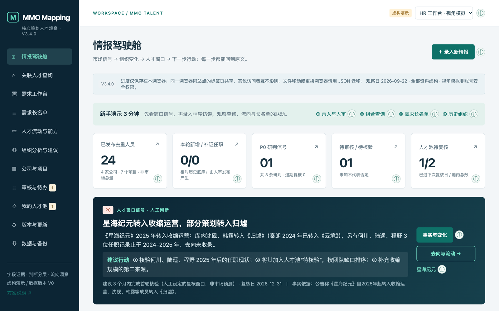
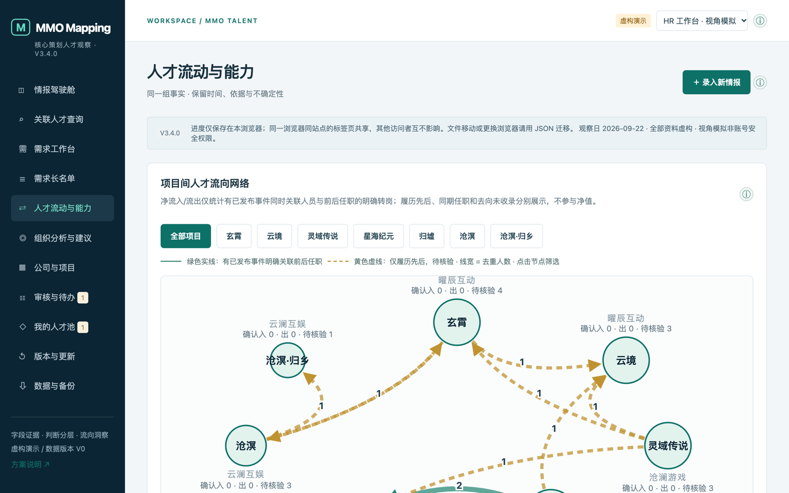
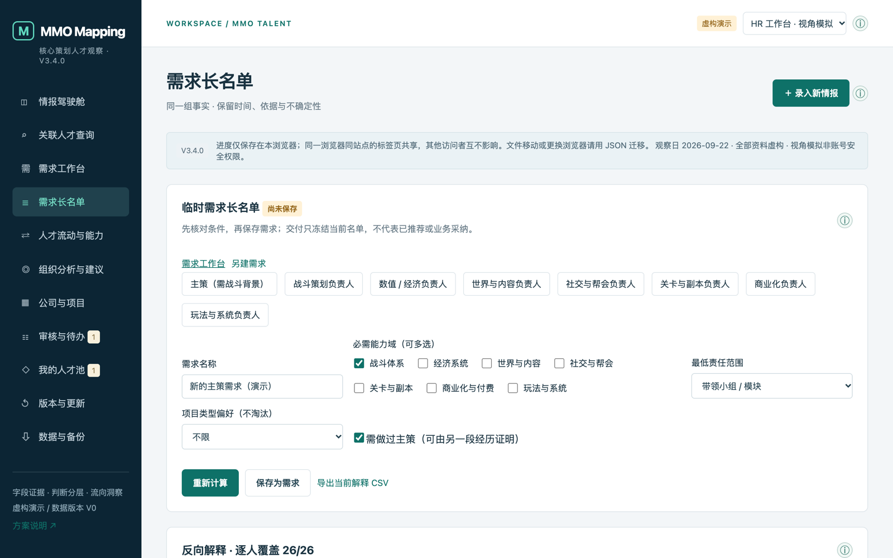
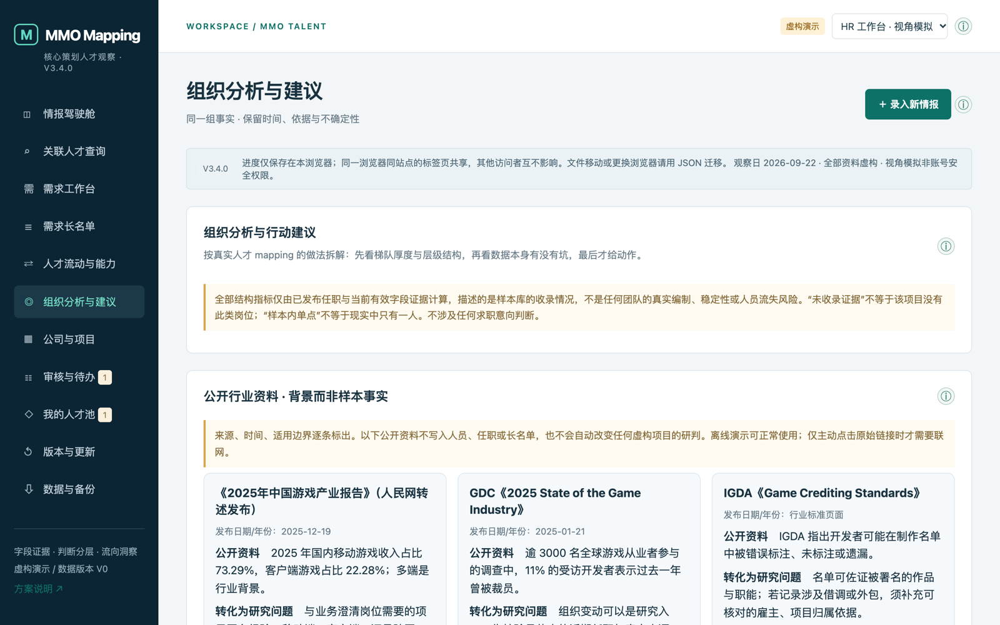

<div align="center">

# MMO Mapping

### 每一条人才结论，都能点回原文

**面向 HRBP 与招聘团队的 MMO 核心策划人才情报工作台**
*An evidence-first talent mapping workbench: every insight traces back to its source.*

[**▶ 在线体验**](https://jasmineyao1112.github.io/mmo-mapping/) · [背景知识](docs/background-knowledge.md) · [业务价值与评价指标](docs/business-value-and-metrics.md) · [工程交接](HANDOFF.md)

`V3.4.0` · 单文件 HTML · 零依赖 · 离线可用 · 手机可打开 · 218 项自动化测试

</div>

---



## 它解决什么问题

做过人才 mapping 的人，大多遇到过这些场景：

- 业务问：「你说这个人做过战斗主策，**依据是什么？**」答案却埋在三个月前的某个 Excel 单元格里。
- 需求关闭后，花几周摸清的市场认知**随着表格一起消失**；下次遇到同类岗位，又要从零开始。
- 流向图显示「A 项目流出 5 人」，细看才发现其中 2 人只是**借调**，1 人是**同名的另一个人**。

**MMO Mapping 的思路是：mapping 的价值不在于名单有多长，而在于每个结论都经得起追问。**

## ✨ 亮点

### 1 · 字段级证据链：可信度来自原文，而不是一个分数
任职的项目、头衔、起止年、责任范围，**每个字段都单独记录**一条证据：逐字引文、来源 ID 和依据类型（原文明确 / 推定边界 / 未知）。界面上每个 ⓘ 都能下钻到原文。隔离一个来源后，所有依赖它的结论会自动重算。

### 2 · 四层流向口径：不把「履历先后」当成「跳槽」



借鉴公开人才流向产品「机构总览 → 点击过滤 → 逐条记录 → 来源」的交互路径，并**收紧统计口径**：

| 🟢 明确转岗 | 🟡 履历先后 | 🔀 同期跨项目 | ❔ 去向未收录 |
|---|---|---|---|
| 有事件同时关联这个人及其前后任职，**才计入净流量** | 只能确认时间先后，标为待核验 | 可能是借调或兼任，单独列出 | 最近任职已结束，**不等于离职** |

宁可少算，也不混算。

### 3 · 需求对象化与反向解释：解释「为什么是他」，也解释「为什么不是他」



- 招聘需求带版本号（v1 → v2），修改条件必须填写原因；每次交付冻结名单快照，历史记录不会被悄悄改写。
- 长名单按 **A / B / C** 分层，并给全库**每一个人**列出未入选原因：缺证、责任范围不足或偏好未命中。
- 和业务讨论「要求是否现实」时，可以用落选原因分布作为客观起点，而不是凭感觉争论。

### 4 · 组织分析：识别真实 mapping 中常见的数据问题



样本人物虽然是虚构的，但每个人对应一类真实 mapping 中反复出现的问题：**同名不同人、同期借调、离开后回流、外包身份不明、职级自述冲突、二手转述**。系统会逐一检出，再按 P0 / P1 / P2 给出行动建议，例如先排查同名污染，再判断梯队是否真的单薄。

梯队厚度、责任层级和人才画像描述的都是**收录状态**，不是真实编制。系统会主动区分「收录不足」和「真的单薄」，避免发出误导性的单点风险告警。

### 5 · 公开行业资料只作背景，不混入样本事实
内置 2025 中国游戏产业报告、GDC 2025、IGDA 署名标准、LinkedIn Future of Recruiting 等公开资料。每条都写明**可转化为什么研究问题**和**不能推出什么**，例如：署名不等于雇佣关系，全球裁员调查也不能用来推断某个人的求职意向。

### 6 · 守住招聘伦理红线
- **不推断求职意向，不记录联系方式**：「强意向 / 可挖性高」这类表述会被系统直接拦截。
- 判断和事实分开存储；人工发布不等于独立交叉核验。
- 当前抽取为确定性模拟，**不把模拟冒充成 AI**。

## 🚀 快速开始

**直接用**：打开 [在线版](https://jasmineyao1112.github.io/mmo-mapping/)，或下载仓库里的 `index.html` 双击打开。不需要联网、账号或服务器，手机浏览器也能用。

**3 分钟演示路线**
1. 在「关联人才查询」中搜索「战斗 + 主策」，审核前只命中 **顾航**。
2. 录入材料①（林序访谈）→ 逐字段人审 → 发布，命中结果变为 **林序、顾航**。
3. 沿「林序 → 《玄霄》2022 → 战斗策划组 → 周岚」一路下钻到组织。
4. 打开「人才流动与能力」，点击任意项目过滤，再点一条边查看人物、任职和原文。
5. 打开「需求工作台」，保存 v1 → 交付 → 修改条件保存 v2 → 对比分层变化。

**开发者**
```bash
python3 scripts/build.py                 # 把 dist/ 构建为单文件 index.html
node tests/model.test.cjs                # 领域模型测试
node tests/artifact.test.cjs             # 单文件产物与源码一致性
node --test tests/*.test.cjs             # 全部 node:test 用例
```
改动规则和产品红线见 [HANDOFF.md](HANDOFF.md)。

## 🧱 技术特点

| | |
|---|---|
| **形态** | 构建脚本把 12 个模块和 CSS 内联为一个约 330KB 的 HTML |
| **依赖** | 0 个 CDN、0 个外部字体、0 个 npm 运行时包、0 个 API Key |
| **数据** | 浏览器本地存储，支持 JSON 导入导出；带版本号的幂等迁移（`dataVersion=33`） |
| **质量** | 218 项领域与产物测试；浏览器在线 / 离线 / 禁用存储三种环境回归；390px 手机宽度下无横向溢出 |
| **安全** | 所有渲染内容统一转义；导入时严格校验 |

## 📚 文档

| 文档 | 内容 |
|---|---|
| [docs/background-knowledge.md](docs/background-knowledge.md) | mapping 方法、数据模型、流向四层口径、六类数据问题、行业资料用法 |
| [docs/business-value-and-metrics.md](docs/business-value-and-metrics.md) | 业务价值论证 + 四层评价指标体系（资产 / 质量 / 效率 / 业务） |
| [HANDOFF.md](HANDOFF.md) | 工程交接：目录、构建测试、改动规则、已知边界、路线图 |
| [dist/README.md](dist/README.md) | V3.0 → V3.4 各版本功能说明 |

## ⚠️ 声明

本项目是**作品集演示原型**。其中的公司、项目和人物**全部虚构**，与任何现实公司或个人无关；公开行业资料仅作研究背景引用。当前版本没有后端、账号权限或真实 AI 抽取能力。

---

<div align="center">

Built by **Jiatong (Jasmine) Yao** · [个人主页](https://jasmineyao1112.github.io/)

</div>
